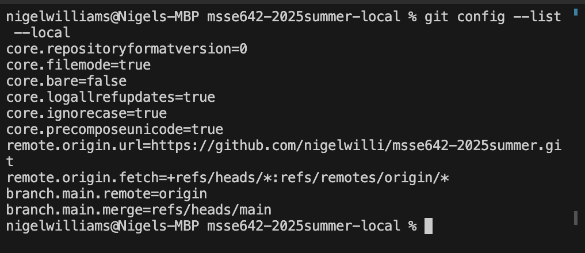
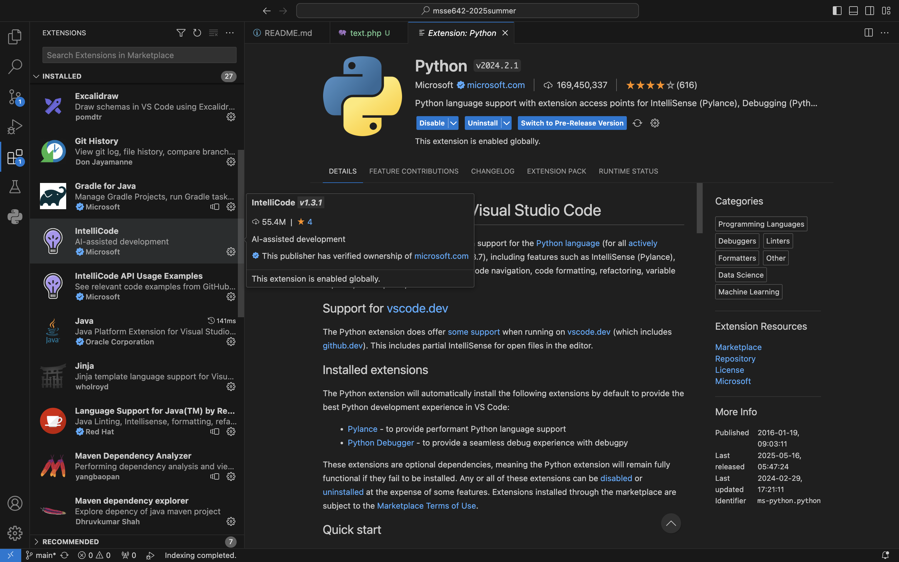
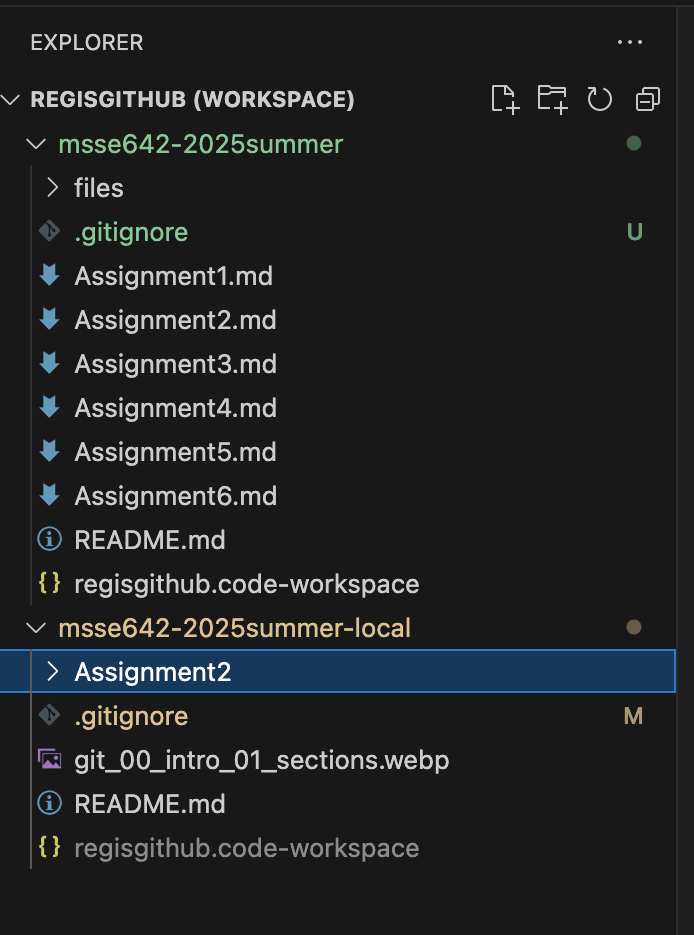

## ACTIVITY 1: Configure Visual Studio Code (VSC)



## Installed Extensions




## ACTIVITY 2: Clone the class repo and add to your VSC Workspace




## ACTIVITY 3: Writing a good readme file  

A good README file usually contains:


# Project Title
A concise, descriptive name for your project.

---

## 🚀 Overview
A short paragraph explaining what the software does, why it exists, and who it’s for.

---

## 📋 Table of Contents
- [Overview](#-overview)
- [Demo/Screenshots](#-demo-screenshots)
- [Installation](#-installation)
- [Usage](#-usage)
- [Configuration](#-configuration)
- [Features](#-features)
- [Contributing](#-contributing)
- [License](#-license)
- [Contact](#-contact)

---

## 🎬 Demo / Screenshots
_Add a GIF or series of images showing your app in action._

---

## 💾 Installation
Step-by-step instructions to get your environment up and running:

```bash
# 1. Clone the repo
git clone https://github.com/yourusername/your-project.git

# 2. Install dependencies
cd your-project && npm install

# 3. Start the app
npm start
```

---

## ▶️ Usage
Examples of common commands and code snippets:

```bash
# Run in development mode
npm run dev

# Build for production
npm run build
```

---

## ⚙️ Configuration
Describe configurable options (environment variables, config files, flags):

| Variable           | Description                     | Default   |
| ------------------ | ------------------------------- | --------- |
| `PORT`             | Port the server listens on      | `3000`    |
---

## 🌟 Features
- Feature A: Brief description.
- Feature B: Brief description.
- Feature C: Brief description.

---

## 🤝 Contributing
1. Fork the repo  
2. Create a feature branch (`git checkout -b feature/xyz`)  
3. Commit your changes (`git commit -m "Add xyz feature"`)  
4. Push to branch (`git push origin feature/xyz`)  
5. Open a Pull Request

Include any coding style guidelines or tests you expect contributors to run.

---

## 📜 License
Distributed under the [MIT License](./LICENSE). See `LICENSE` for details.

---

## 📫 Contact
Your Name – [@yourhandle](https://twitter.com/yourhandle) – email@example.com  
Project Link: https://github.com/yourusername/your-project

---

## 🙏 Acknowledgements
- [Resource 1](https://…)  
- [Resource 2](https://…)  
- Inspiration or Libraries you used


