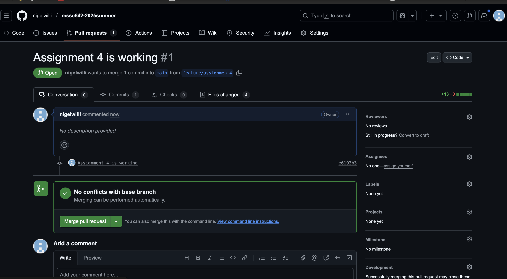

## ACTIVITY 1: Create branch in Visual Studio Code (VSC)

## Step 1 - Created a feature branch

## Step 2 - Check remote branch

**Difference Between `git branch` and `git branch -r`:**

- `git branch` lists all **local** branches in your repository.
- `git branch -r` lists **remote-tracking** branches (branches on the remote repository) that your local Git is aware of.

## Step 3: Commit changes

## Step 3: Pull request

