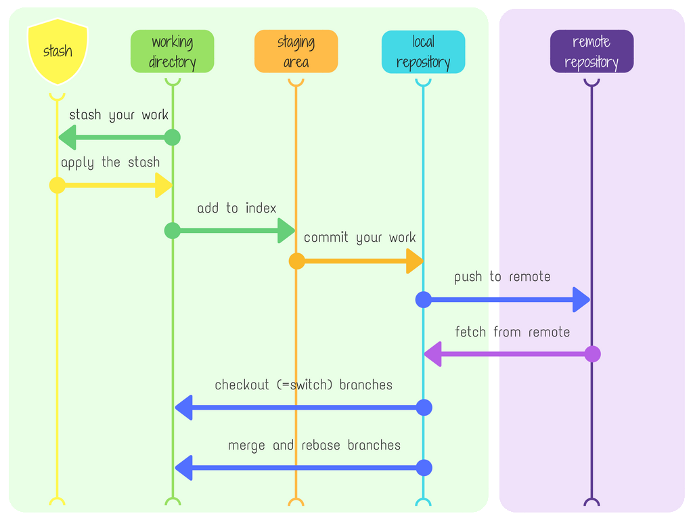

# msse642-2025summer

1. Types of Version Control Systems

- Local VCS: Stores versions in a local database on your machine. Simple but risky if the disk fails.

- Centralized VCS: A single “central” server holds the project history; clients check out snapshots and commit changes back to it (e.g., Subversion, Perforce).

- Distributed VCS (DVCS): Every user clones the entire repository (full history). You work offline and commit locally; then push/pull to share with others. Git is a distributed VCS and thus you always have the full project history on your machine.

Git differs from many older systems by storing snapshots of your project at each commit, rather than just the diffs between versions. This makes operations like branching and merging extremely fast and robust.

2. What Is a Repository?

A repository (or “repo”) is the database where Git stores commits (snapshots), branches, tags, and the full history of your project.

Local repository: The .git folder in your working copy holds your personal copy of the history.

Remote repository: A shared repo (e.g., on GitHub, GitLab, Bitbucket) that you push to or pull from when collaborating.

3. What Is a Commit?

A commit records a snapshot of the staging area into your local repository.

Each commit has a unique SHA-1 hash, an author/committer, a timestamp, and a commit message.

Think of commits as “milestones” in your project’s timeline.

4. What Is the Working Directory?

The working directory (or working tree) is where you actively edit files.

It reflects the state of files checked out from the local repository at a given branch or commit.

Files here can be untracked, modified, or staged.

5. What Is the Staging Area?

Also called the index, this is an intermediate holding area where you “stage” specific changes before committing.

You use git add to move changes from the working directory into the staging area, preparing them for the next commit.

The staging area lets you craft commits that include only the files and hunks you want.

6. Diagram of Git’s Architecture & Flow
The image above illustrates the three core areas of Git and how commands move changes between them, as well as how your local repository syncs with a remote counterpart.

- Edit files in the Working Directory

- Stage changes with git add (→ Staging Area)

- Commit staged changes with git commit (→ Local Repository)

- Push or Pull to synchronize with the Remote Repository

This three-stage model, combined with lightweight branching and full local history, is what gives Git its power and flexibility.

